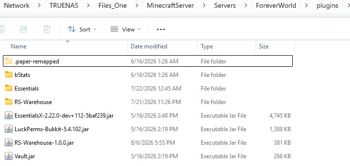

Welcome to the # Installation & Setup

This guide will walk you through installing RS-Warehouse and preparing it for first use.

---

# Requirements

Before installing RS-Warehouse, ensure your server meets the following requirements.

- Paper 1.21.x or newer
- Java 21 or newer

---

# Step 1 - Download RS-Warehouse

Download the latest release of RS-Warehouse.

---

# Step 2 - Install the Plugin

Copy **RS-Warehouse.jar** into your server's **plugins** folder.

```
plugins/
└── RS-Warehouse.jar
```

---

📷 Screenshot



# Step 3 - Start Your Server

Start your Paper server.

During startup RS-Warehouse will automatically create its data folder, configuration file, and SQLite database.

📷 Screenshot


---

# Step 4 - Verify Installation

After the server has started, verify that the plugin created its data folder.

Your plugins folder should now contain:

```
plugins/
└── RS-Warehouse/
    └── db-files-templates
        ├── empty_database.db
        └── populated_database.db
    ├── config.yml
    └── database.db
    
    
```

```
NOTE:
RS-Warehouse comes with 2 additional database files.
1) empty_database.db = A totally empty database file. No categories, no items.
   the only items contained in this databse are the Uncategorized, Server 
   Rules, Server Commands, and Auto-Deposit categories
2) populated_database.db = A populated and organized database for your ease of 
   use. This is the default database.
   
If you wish to start with a completely empty database, simply delete the plugins
database.db file, copy the empty_database.db file to the /RS-Warehouse directory 
and rename it to database.db.  Be sure to enter the admin menu and reload the 
plugin or restart your server for the change to take effect.

```
