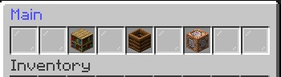
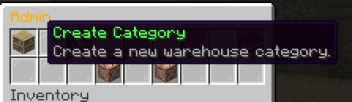
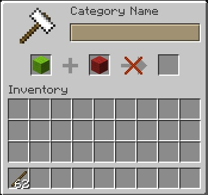
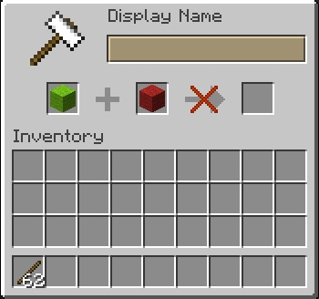
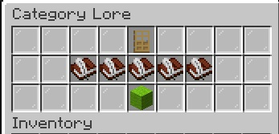
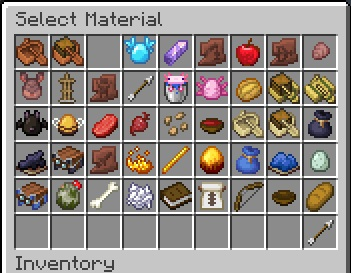

# Creating Your First Category
Categories are used to organize items in the Warehouse. Your first category can be created from the **Admin Menu**.

## Open the Admin Menu

📷 Screenshot

Open the Warehouse by sneaking and right clicking a warehouse chest with a stick and select the **Admin** option.  From the Admin Menu, select:
**Create Category**.  That option is the Book shelf icon.

📷 Screenshot

## Enter the Internal Name
The first step is to enter the category's internal name. This is an internal identifier that may be used for later features.

📷 Screenshot

The internal name is used internally by RS-Warehouse and is not normally shown to players.  Enter the name you want to use and confirm it.

## Enter the Display Name
Next, enter the name that players will see when viewing the category.

📷 Screenshot

Choose a clear name that describes the items the category will contain.

For example:
- Building Blocks
- Tools
- Food
- Ores

## Add a Description
The category can have a description that appears in the category menu.

📷 Screenshot

You can add up to five lines of description text.

This is useful for explaining what belongs in the category.

## Choose the Category Icon
Next, select the material that will be used as the category's icon.

📷 Screenshot

The **Select Material** menu displays available Minecraft items across multiple pages. Select the item you want to use as the category icon. 
After you click on the item you want to use as the icon, the category will be created.