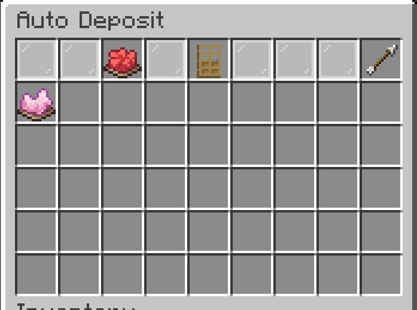

# Auto-Deposit

**Auto-Deposit** allows each player to choose which items should automatically be sent to the Warehouse when they pick them up.
When a player picks up an item that has been added to their Auto-Deposit filter, the item is sent directly to the Warehouse instead of being added to their inventory.

> **NOTE:** Auto-Deposit is configured separately by each player. Your Auto-Deposit items do not affect other players.

---

## Adding an Item to Auto-Deposit

Open the Warehouse and access the **Auto-Deposit** menu.
To add an item to your Auto-Deposit filter, place the item into the Auto-Deposit menu.
RS-Warehouse copies the item into your Auto-Deposit filter.
The original item is **not removed from your inventory**.

📷 Screenshot
 

---

## How Auto-Deposit Works

Once an item has been added to your Auto-Deposit filter, you can simply pick up that item normally.
When you pick up an item that matches one of your Auto-Deposit items:

1. RS-Warehouse detects the item pickup.
2. The item is sent directly to the Warehouse.
3. The item is not added to your inventory.

---

## Items Not in the Filter

Items that are not in your Auto-Deposit filter behave normally.
When you pick up an item that has not been added to Auto-Deposit, Minecraft adds the item to your inventory as usual.
This allows you to choose exactly which items should be automatically sent to the Warehouse.

---

## Managing Your Auto-Deposit Items

Your Auto-Deposit filter can be changed at any time.
Open the Auto-Deposit menu to view the items currently configured for automatic deposit.

📷 Screenshot

Items can be removed from the filter when you no longer want them to be automatically deposited by simply picking them 
up.  The item will disappear and will no longer be in the filter.

---

## Pausing/Resuming Auto-Deposit

*Auto-Deposit* may be paused and resumed by clicking on the **DYE** in the top row.  If the **DYE** is **RED**
then *Auto-Deposit* is paused. If it is **GREEN** then *Auto-Deposit* is running.

> **NOTE:** Items within the *Auto-Deposit* filter cannot be withdrawn from the warehouse as long as *Auto-Deposit*
> is enabled. Pausing *Auto-Deposit* will allow you to withdraw those items from the warehouse again.

## Using Auto-Deposit with the Warehouse

Auto-Deposit is especially useful for items that you collect frequently.
For example, you may want all of the following to automatically go to the Warehouse:

- Cobblestone
- Stone
- Dirt
- Ores
- Farmed materials
- Mob drops

Instead of filling your inventory with these items, they can be sent directly to the Warehouse as you collect them.

---

## Auto-Deposit Is Player-Specific

Each player's Auto-Deposit filter is independent.

For example, Player A can configure:

- Cobblestone
- Stone
- Dirt

while Player B can configure:

- Iron Ore
- Coal
- Diamonds

The two players' filters do not affect one another.

> **IMPORTANT:** Adding an item to your Auto-Deposit filter does not automatically configure it for other players.
