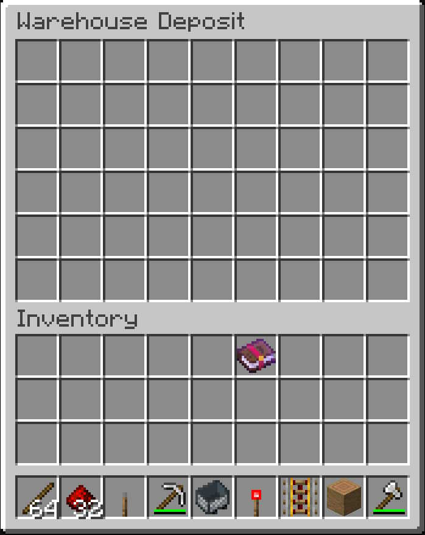
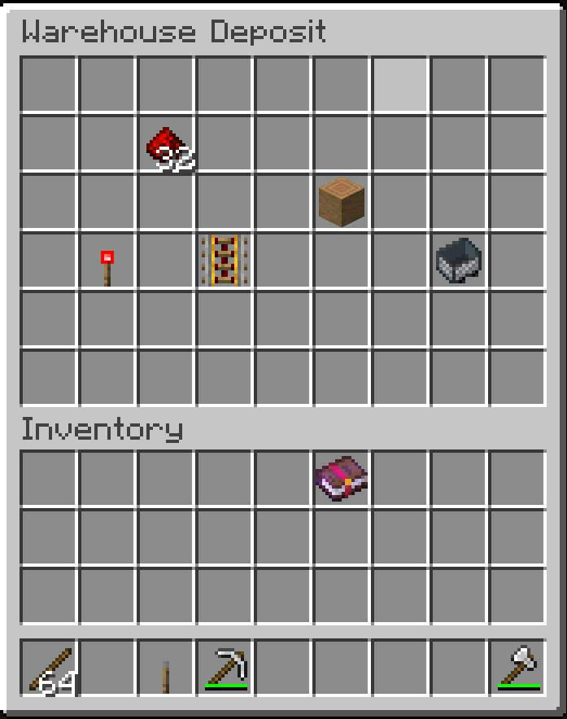

# shop deposit
The `/shop deposit` command opens the **Mass Deposit** menu, allowing you to deposit multiple items from your inventory into the Warehouse at once.
This is useful when you want to quickly deposit several items without opening the Warehouse Chest.

---

## Opening the Mass Deposit Menu
Use:

    /shop deposit

The command opens the Mass Deposit screen.

📷 Screenshot

---

## Adding Items
Place the items you want to deposit into the Mass Deposit menu.
Items can be added individually or in larger quantities.
Once the items have been added, the menu provides the option to process the deposit.

📷 Screenshot

---

## Using `/shop deposit`

### 1. Open the menu

    /shop deposit

### 2. Add items
Place the items you want to deposit into the Mass Deposit menu.

### 3. Process the deposit
The items will be deposited when you close the menu out..

### 4. Items are deposited
Successfully processed items are added to the Warehouse.
Any items that cannot be processed remain in the players inventory.
