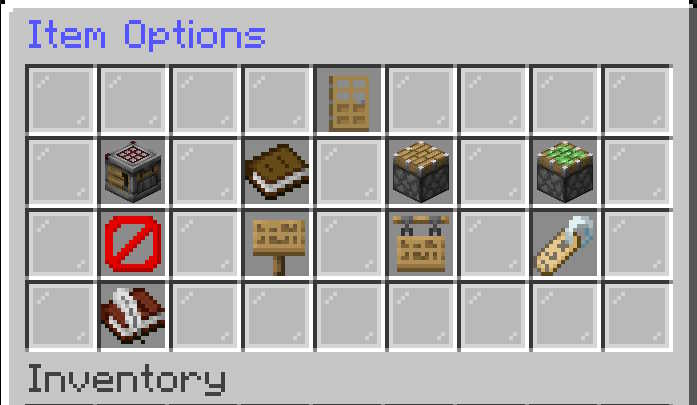

# Item Options
The **Item Options** menu provides administrators with tools for managing individual items in the Warehouse.
To open Item Options, **Shift-Right-Click** an item while viewing a category.

📷 Screenshot

The available options allow you to change how an item is displayed, organize items into categories and subcategories, control its position in the menu, and remove or duplicate item references.

---

## Edit Display Name
Icon: Name Tag
Change the name displayed to players for the selected item.

---

## Create SubCategory
Icon: Crafter
Create a new SubCategory using the selected item as the starting point.  The Original item will be copied into the SubCategory when it is created.

---

## Assign Page / Slot
Icon: Book
Choose which page and slot the item appears in within its category.

---

## Edit Lore
Icon: Book With Quill
Change the description displayed underneath the SubCategory.

---

## Move to Category
Icon: Piston
Move the item from its current category to another category.

---

## Move to SubCategory
Icon: Sticky Piston
Move the item into an existing SubCategory.

---

## Delete Item
Icon: Barrier Block
Delete the selected item reference from the Warehouse.
Deletion is permanent and may be restricted when the item is still being used or contains inventory.

---

## Copy to Category
Icon: Sign
Create an additional reference to the same Warehouse item in another category.

---

## Copy to SubCategory
Icon: Hanging Sign
Create an additional reference to the same Warehouse item in a SubCategory.

---

## Back
Icon: Door
The **Back** button returns you to the category and page where the item was selected.

---

## Item Options at a Glance

| Option | Purpose |
|---|---|
| **Edit Display Name** | Change the item's displayed name |
| **Create SubCategory** | Create a SubCategory from the item |
| **Assign Page / Slot** | Choose the item's page and menu position |
| **Edit Lore** | Change the item's displayed description |
| **Move to Category** | Move the item to another category |
| **Move to SubCategory** | Move the item into a SubCategory |
| **Delete Item** | Remove the item reference |
| **Copy to Category** | Add another category reference |
| **Copy to SubCategory** | Add another SubCategory reference |
| **Back** | Return to the previous item list |

**Note:** 
Some options are unavailable for special items such as **Convert To SubCategory** and **Delete** 
